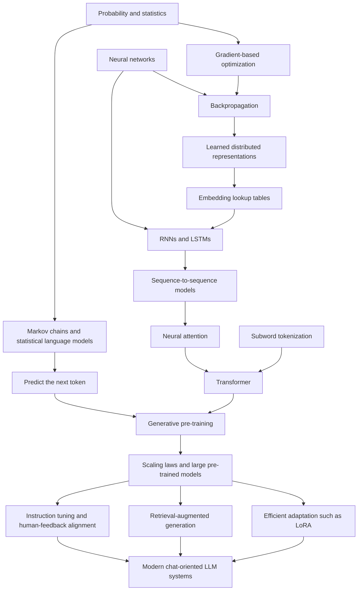

Path: 001-008-history-road-to-llms.md

# 001-008. History Roadmap: How We Reached Modern LLMs

## Scope

Modern LLMs were not invented in one step. They combine ideas from probability,
linguistics, information theory, neural networks, optimization, distributed
computing, and software engineering.

This page is a learning roadmap, not a claim that every relevant invention fits
into one linear chain. The main table focuses on inventions that help explain
why current LLMs look the way they do. Later tables show important side branches
and ideas that were displaced as the default approach but remain useful.

## Main route in one graph



## Important clarification: tables are older than LLMs

An embedding table is a matrix used as a lookup table:

```text
token_id -> vector
```

The lookup operation is simple. The row vectors are learned parameters. The
embedding table is not a neural network by itself, but in an LLM it is trained
as part of the larger neural network, usually through the same loss,
backpropagation, and optimizer process as the other parameters.

There is no single invention date for lookup tables. They are a general
computing technique. Learned vector representations also existed long before
ChatGPT. Several historically important milestones are listed below.

## Timeline: foundations and the main path

| Period | Invention or milestone | Important names | Problem at the time | What the idea contributed | What remained unsolved |
| --- | --- | --- | --- | --- | --- |
| 1906-1913 | Markov chains; statistical analysis of text sequences | Andrey Markov | How can dependent events be modeled mathematically instead of assuming every event is independent? | A sequence can be modeled using conditional probabilities. In 1913, Markov analyzed letter sequences in Pushkin's *Eugene Onegin*. | Short-memory models cannot express deep meaning or long-range context. |
| 1948 | Information theory | Claude Shannon | How can information, uncertainty, and communication be measured? | Entropy and probabilistic reasoning provided core language-model concepts. Shannon also discussed approximating English with increasingly rich statistical models. | A statistical model of text is not yet a trainable general-purpose language system. |
| 1957-1958 | Perceptron | Frank Rosenblatt | Can a machine learn a decision boundary from examples? | A trainable weighted model demonstrated that parameters can be adjusted from data. | A single linear layer cannot represent many complex functions. |
| 1960s-1980s | N-gram language models | Many researchers in speech and NLP | How can a system estimate the next word from text data? | Count short sequences and estimate `P(next_word | recent_words)`. This made next-token prediction concrete and practical. | Sparse counts explode as context length grows. Similar words do not automatically share knowledge. |
| 1970s-1980s | Automatic differentiation and backpropagation foundations | Seppo Linnainmaa; Paul Werbos; David Rumelhart; Geoffrey Hinton; Ronald Williams | How can a multi-layer parameterized computation graph learn useful internal features? | Gradients can be propagated backward through composed operations. The widely influential 1986 paper showed how hidden neural-network units can learn representations. | Deep and recurrent networks can still suffer from vanishing or exploding gradients. |
| 1980s | Distributed representations | Geoffrey Hinton and other connectionist researchers | How can concepts be represented without assigning one symbolic slot to every meaning? | Meaning can be spread across patterns of numeric features rather than stored in one human-readable cell. | Training useful representations at scale remained difficult. |
| 1990 | Latent Semantic Analysis (LSA) | Scott Deerwester; Susan Dumais; George Furnas; Thomas Landauer; Richard Harshman | Exact keyword matching misses relationships between related terms and documents. | Matrix factorization produced lower-dimensional vector representations for information retrieval. This is an important pre-LLM example of learned vector spaces. | LSA is not a generative neural language model and does not model token order well. |
| 1993 | Statistical machine translation and IBM Models | Peter Brown; Stephen Della Pietra; Vincent Della Pietra; Robert Mercer | Hand-written translation rules are expensive and brittle. | Learn probabilistic translation and alignment parameters from bilingual corpora. | Pipelines still relied on specialized components and limited statistical assumptions. |
| 1997 | Long Short-Term Memory (LSTM) | Sepp Hochreiter; Jurgen Schmidhuber | Ordinary recurrent neural networks struggle to preserve information across long spans because gradients vanish or explode. | Gated recurrent memory made longer-range sequence learning more practical. | Recurrence processes tokens sequentially, limiting parallel training and making very long contexts difficult. |
| 2000 / 2003 | Neural probabilistic language model with learned word vectors | Yoshua Bengio; Rejean Ducharme; Pascal Vincent; Christian Jauvin | N-gram models face the curse of dimensionality: unseen word combinations receive poor estimates. | Learn a real-valued vector for each vocabulary item jointly with a neural probability model. Similar words can share statistical strength. The word mapping is represented as a trainable matrix of free parameters. | Training is expensive, context is still limited, and the architecture predates modern Transformers. |
| 2013 | word2vec: efficient word-vector learning | Tomas Mikolov; Kai Chen; Greg Corrado; Jeffrey Dean; Ilya Sutskever | Useful word vectors existed, but learning them efficiently from very large corpora was still costly. | CBOW, Skip-gram, negative sampling, and related techniques made high-quality static word embeddings widely accessible. | A word receives one context-independent vector; word order and context-specific meaning remain weakly represented. |
| 2014 | Sequence-to-sequence learning | Ilya Sutskever; Oriol Vinyals; Quoc Le | How can one neural network map a variable-length sequence to another sequence, such as a translation? | An encoder LSTM compresses the input; a decoder LSTM generates the output. | Compressing a long source sequence into one fixed-length vector creates a bottleneck. |
| 2014 | Neural attention for translation | Dzmitry Bahdanau; Kyunghyun Cho; Yoshua Bengio | A single fixed-length encoder vector loses information, especially for long sentences. | Let the decoder soft-search relevant source positions while generating each output token. | RNN-based attention still has sequential computation bottlenecks. |
| 2016 | Subword tokenization for neural machine translation | Rico Sennrich; Barry Haddow; Alexandra Birch | Word-level vocabularies cannot handle rare words, new words, names, and rich morphology efficiently. | Encode uncommon words as sequences of subword units. Modern LLM tokenizers build on this general direction. | Tokenization remains an engineering trade-off; subwords do not solve reasoning or factuality. |
| 2017 | Transformer | Ashish Vaswani; Noam Shazeer; Niki Parmar; Jakob Uszkoreit; Llion Jones; Aidan Gomez; Lukasz Kaiser; Illia Polosukhin | Recurrent models are hard to parallelize and struggle with long dependency paths. | *Attention Is All You Need* replaced recurrence with attention-based blocks, enabling much more parallel training. | Standard self-attention cost grows quickly with sequence length; architecture alone does not create a useful assistant. |
| 2018 | GPT: generative pre-training followed by task adaptation | Alec Radford; Karthik Narasimhan; Tim Salimans; Ilya Sutskever | NLP systems often require a separate labeled dataset and architecture for each task. | Pre-train a Transformer language model on unlabeled text, then adapt it to downstream tasks. | Fine-tuning is still required for many tasks; model scale is modest by later standards. |
| 2018 | BERT: bidirectional Transformer pre-training | Jacob Devlin; Ming-Wei Chang; Kenton Lee; Kristina Toutanova | Left-to-right language models do not use both left and right context when building representations for understanding tasks. | Masked-language-model pre-training made strong reusable bidirectional representations for NLP classification and extraction tasks. | BERT is encoder-oriented and not the direct architectural path for free-form autoregressive chat generation. |
| 2019 | GPT-2 and zero-shot multitask behavior | Alec Radford; Jeffrey Wu; Rewon Child; David Luan; Dario Amodei; Ilya Sutskever | Can a next-token predictor trained on diverse text perform tasks without task-specific training? | Scaling a decoder-only Transformer showed increasingly general zero-shot behavior. | Outputs remain unreliable, prompt-sensitive, and weakly aligned with user intent. |
| 2020 | GPT-3 and in-context learning | Tom Brown and many OpenAI collaborators | Can task adaptation happen from instructions or examples in the prompt, without weight updates? | A 175-billion-parameter autoregressive model demonstrated strong few-shot behavior through text interaction alone. | Larger models still hallucinate, inherit biases, and do not naturally follow user intent reliably. |
| 2020 | Empirical neural scaling laws | Jared Kaplan; Sam McCandlish; Tom Henighan and collaborators | How should model size, data, and compute be balanced? | Measured power-law trends showed that predictable improvements can come from scaling models, datasets, and training compute. | Scaling is expensive and does not automatically solve alignment, knowledge freshness, or efficiency. |
| 2020 | Retrieval-Augmented Generation (RAG) | Patrick Lewis; Ethan Perez; Aleksandra Piktus and collaborators | Parameters alone are difficult to update, inspect, cite, and keep factually current. | Combine a generator with retrieved external documents or vector-indexed passages. | Retrieval quality, context selection, and faithful use of sources remain difficult. |
| 2021 | Sparse Mixture-of-Experts scaling | William Fedus; Barret Zoph; Noam Shazeer and earlier MoE researchers | Dense models use every parameter for every token, making scale expensive. | Route inputs through selected experts so parameter count can grow without proportional compute growth. | Routing, communication cost, load balancing, and training stability are hard. |
| 2021 | LoRA and parameter-efficient adaptation | Edward Hu; Yelong Shen; Phillip Wallis and collaborators | Fully fine-tuning a very large model for every task is expensive to store and train. | Freeze the base model and train small low-rank matrices that represent an adaptation. | Efficient adaptation does not replace pre-training and does not guarantee factuality or alignment. |
| 2022 | InstructGPT and RLHF for instruction-following | Long Ouyang; Jeff Wu; Xu Jiang and collaborators | A good next-token predictor is not automatically helpful, truthful, or responsive to user instructions. | Use demonstrations, ranked outputs, and reinforcement learning from human feedback to better align behavior with user intent. | Human feedback is costly and imperfect; alignment remains an active research problem. |
| 2022 | ChatGPT public release | OpenAI | Strong language models were still awkward for ordinary users to interact with. | A conversational product made instruction-following LLMs broadly accessible and accelerated adoption. | Product release is not a single new mathematical invention; reliability, safety, and knowledge limits remain. |
| 2023 | Open-weight foundation-model ecosystem expands | Meta AI and many research groups | Frontier-scale experiments were difficult for many researchers and developers to reproduce or adapt. | LLaMA and later open-weight model families widened access to efficient foundation models and local experimentation. | Training frontier models remains expensive; licensing, safety, and evaluation differ across releases. |

## The recurring pattern: problem and solution

| Problem | Earlier default | Later step that helped | Core lesson |
| --- | --- | --- | --- |
| Text events depend on earlier text | Independent-event assumptions | Markov and conditional-probability models | Context matters. |
| Long contexts create too many exact combinations | N-gram count tables | Learned distributed representations and neural language models | Similar items should share statistical strength. |
| Rare or unseen words break fixed word vocabularies | One token per complete word | Subword tokenization | Reuse smaller pieces to handle an open vocabulary. |
| Multi-layer systems need coordinated learning | Manually chosen features or shallow models | Backpropagation and gradient-based optimization | Learn internal features from end-to-end error signals. |
| RNNs forget or distort distant information | Simple recurrence | LSTM gates | Memory requires mechanisms that protect useful signals. |
| Encoder-decoder bottleneck loses source details | One fixed-length summary vector | Attention | Let the model retrieve relevant internal states dynamically. |
| RNN computation is sequential | Recurrent attention models | Transformer self-attention | Parallelizable architecture enables much larger training runs. |
| Every NLP task needs labeled data | Task-specific supervised models | Generative pre-training and prompting | One general objective can produce reusable capabilities. |
| Bigger dense models are expensive | Full dense computation | Scaling analysis, MoE, distributed training, efficient adaptation | Architecture and systems engineering determine feasible scale. |
| Parameters are stale and hard to cite | Parametric memory only | RAG and external tools | Some knowledge should be retrieved at runtime. |
| Next-token prediction does not equal helpfulness | Base pre-trained model | Instruction tuning and preference optimization | Product behavior requires post-training. |

## What exactly was inherited by modern LLMs?

| Modern LLM component | Older idea behind it | What changed over time |
| --- | --- | --- |
| Token IDs | Discrete symbols and vocabulary encoding | Modern tokenizers usually use subword pieces rather than only whole words. |
| Embedding table | Lookup table plus learned distributed representation | Rows are jointly trained as model parameters; contextual meaning later emerges through Transformer layers. |
| Next-token prediction objective | Statistical language modeling | Neural models generalize through learned continuous representations and huge training corpora. |
| Backpropagation | Chain rule, automatic differentiation, gradient optimization | Modern frameworks compute gradients across billions of parameters and distributed devices. |
| Attention matrices | Neural attention mechanisms | Transformer blocks made attention the central computation rather than an addition to an RNN. |
| MLP weight matrices | Multi-layer neural networks | Larger models use many repeated Transformer blocks with learned linear transformations. |
| Prompting | Conditioning a probabilistic model on context | Large-scale pre-training made natural-language prompts surprisingly effective task interfaces. |
| RAG | Information retrieval plus neural generation | External indexes can provide current, inspectable, domain-specific context at runtime. |
| Chat behavior | Dialogue systems plus instruction tuning and preference learning | Post-training shapes a base model into a conversational assistant. |

## Side branches, displaced defaults, and continuing tools

These approaches should not be described simply as failures. Many remain useful.
The point is that they did not become the sole central architecture of modern
general-purpose LLMs.

| Branch or earlier default | Why it mattered | Why it did not become the main LLM path | Where it still matters |
| --- | --- | --- | --- |
| Rule-based AI and expert systems | Captured explicit domain rules and made reasoning inspectable. | Hand-written rules are brittle and expensive to scale across open-ended language. | Business rules, safety constraints, symbolic solvers, and hybrid systems. |
| N-gram language models | Made statistical next-token prediction practical. | Exact context-count tables suffer from sparsity and weak semantic sharing. | Speech systems, baselines, compression, autocomplete, and constrained environments. |
| Bag-of-words and TF-IDF | Fast, understandable text retrieval and classification. | They mostly ignore order, compositional meaning, and generation. | Search, sparse retrieval, interpretable baselines, and hybrid retrieval. |
| Latent Semantic Analysis | Demonstrated useful lower-dimensional semantic spaces. | Linear factorization is less expressive than modern contextual neural models. | Information retrieval history, dimensionality reduction, and conceptual foundations. |
| Static word embeddings such as word2vec | Made vector semantics visible and useful at scale. | One vector per word cannot fully represent context-dependent meaning or token interactions. | Search, lightweight systems, initialization, teaching, and feature engineering. |
| RNNs and LSTMs | Modeled ordered sequences and enabled neural translation. | Sequential processing limits parallel training and makes scaling difficult. | Streaming, time series, smaller recurrent systems, and historical understanding. |
| Encoder-only Transformers such as BERT | Excellent reusable contextual representations for understanding tasks. | They are not the simplest direct route to open-ended autoregressive generation. | Classification, extraction, embeddings, reranking, and search. |
| Encoder-decoder Transformers such as T5 | Strong for transformations from one sequence to another. | Decoder-only models became especially convenient for general prompt-conditioned generation and scaling. | Translation, summarization, structured transformations, and multimodal systems. |
| Retrieval-only systems | Can return inspectable source documents without hallucinating generated prose. | They do not synthesize answers or follow complex natural-language instructions alone. | Search engines, enterprise knowledge bases, and the retrieval half of RAG. |
| Sparse MoE models | Increase parameter capacity without activating all parameters for every token. | Operational complexity and training stability make them harder to build and serve. | Frontier systems and efficiency research. |

## Important distinctions

| Easy misconception | More accurate version |
| --- | --- |
| "ChatGPT invented embeddings." | Learned vector representations predate ChatGPT by decades. Modern LLM embeddings are one stage in a much older line of work. |
| "An embedding table is a neural network." | It is a trainable lookup matrix inside a neural network, not a network by itself. |
| "Tables are trained by completely different rules from neural networks." | Different models can learn tables using different algorithms. In an LLM, the embedding table is normally updated through the same backpropagation and optimizer process as the surrounding network. |
| "Attention was invented only for Transformers." | Neural attention was already important in RNN-based translation models. The Transformer made attention central and removed recurrence. |
| "The Transformer alone created ChatGPT." | Transformers enabled scale, but modern assistants also depend on data pipelines, tokenization, optimization, distributed systems, scaling, instruction tuning, preference learning, evaluation, and product engineering. |
| "RAG permanently teaches the model new facts." | RAG supplies external context at runtime. It usually does not modify the base model weights. |
| "A larger model automatically follows instructions better." | Scale improves many capabilities, but instruction-following behavior requires post-training and careful evaluation. |

## Suggested reading route

Read the papers in this order to follow the main conceptual chain without
trying to read every historical source at once.

| Order | Paper | Why read it |
| --- | --- | --- |
| 1 | [Shannon, 1948: *A Mathematical Theory of Communication*](https://doi.org/10.1002/j.1538-7305.1948.tb01338.x) | Foundations of probabilistic information and entropy. |
| 2 | [Rumelhart, Hinton, and Williams, 1986: *Learning representations by back-propagating errors*](https://doi.org/10.1038/323533a0) | Why backpropagation can learn internal features. |
| 3 | [Deerwester et al., 1990: *Indexing by Latent Semantic Analysis*](https://doi.org/10.1002/(SICI)1097-4571(199009)41:6%3C391::AID-ASI1%3E3.0.CO;2-9) | An important vector-space milestone before modern embeddings. |
| 4 | [Bengio et al., 2003: *A Neural Probabilistic Language Model*](https://www.jmlr.org/papers/v3/bengio03a.html) | Learned word-vector table plus neural language modeling. |
| 5 | [Mikolov et al., 2013: *Efficient Estimation of Word Representations in Vector Space*](https://arxiv.org/abs/1301.3781) | Efficient static word-vector learning. |
| 6 | [Sutskever, Vinyals, and Le, 2014: *Sequence to Sequence Learning with Neural Networks*](https://arxiv.org/abs/1409.3215) | Encoder-decoder sequence learning with LSTMs. |
| 7 | [Bahdanau, Cho, and Bengio, 2014: *Neural Machine Translation by Jointly Learning to Align and Translate*](https://arxiv.org/abs/1409.0473) | Attention as a response to the fixed-vector bottleneck. |
| 8 | [Sennrich, Haddow, and Birch, 2016: *Neural Machine Translation of Rare Words with Subword Units*](https://aclanthology.org/P16-1162/) | Why subword tokenization became important. |
| 9 | [Vaswani et al., 2017: *Attention Is All You Need*](https://arxiv.org/abs/1706.03762) | The Transformer architecture. |
| 10 | [Radford et al., 2018: *Improving Language Understanding by Generative Pre-Training*](https://cdn.openai.com/research-covers/language-unsupervised/language_understanding_paper.pdf) | The original GPT pre-training and adaptation pattern. |
| 11 | [Devlin et al., 2018: *BERT*](https://arxiv.org/abs/1810.04805) | The influential encoder-side branch of Transformer pre-training. |
| 12 | [Radford et al., 2019: *Language Models are Unsupervised Multitask Learners*](https://cdn.openai.com/better-language-models/language-models.pdf) | GPT-2 and zero-shot multitask behavior. |
| 13 | [Brown et al., 2020: *Language Models are Few-Shot Learners*](https://arxiv.org/abs/2005.14165) | GPT-3, scaling, and in-context examples. |
| 14 | [Kaplan et al., 2020: *Scaling Laws for Neural Language Models*](https://arxiv.org/abs/2001.08361) | Quantitative view of model, data, and compute scaling. |
| 15 | [Lewis et al., 2020: *Retrieval-Augmented Generation for Knowledge-Intensive NLP Tasks*](https://arxiv.org/abs/2005.11401) | Why external retrieval complements model parameters. |
| 16 | [Hu et al., 2021: *LoRA: Low-Rank Adaptation of Large Language Models*](https://arxiv.org/abs/2106.09685) | Efficient adaptation without full fine-tuning. |
| 17 | [Ouyang et al., 2022: *Training language models to follow instructions with human feedback*](https://arxiv.org/abs/2203.02155) | How a base language model becomes more useful as an assistant. |
| 18 | [Touvron et al., 2023: *LLaMA: Open and Efficient Foundation Language Models*](https://arxiv.org/abs/2302.13971) | Efficient open-weight foundation models and broader access. |

## Core conclusion

A modern LLM is a large trainable computation graph built from old and new
ideas:

```text
tokens
-> embedding lookup table
-> repeated Transformer blocks
-> next-token probabilities
```

The architecture defines where matrices are used. Backpropagation and an
optimizer adjust their numeric parameters. Large datasets, large compute
budgets, careful tokenization, and post-training make the resulting system
useful. Retrieval and tools can add external knowledge at runtime.

ChatGPT is therefore not the origin of embedding tables, trainable matrices,
next-token prediction, or attention. It is a product built near the end of a
long chain of inventions.
